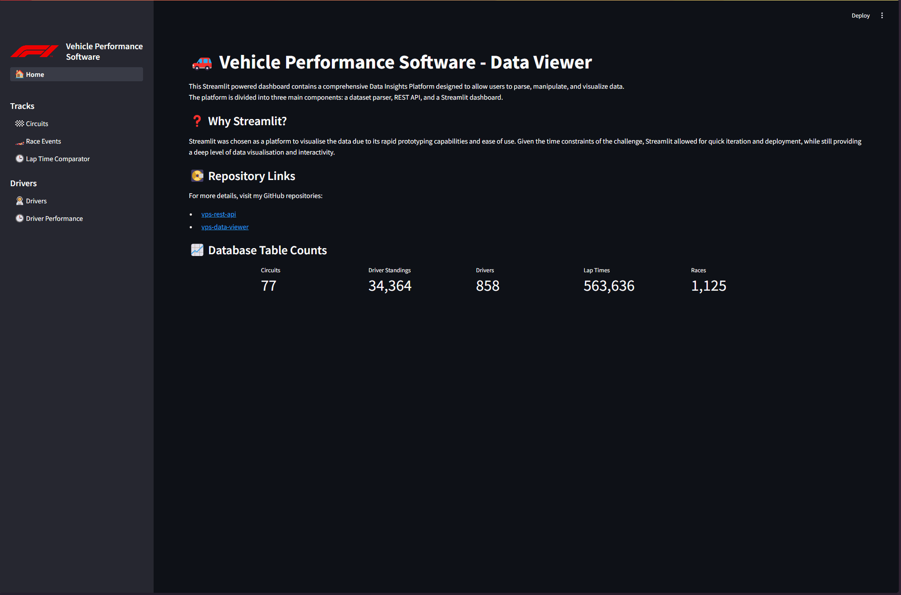

# vps-data-viewer

This Streamlit powered dashboard contains a comprehensive Data Insights Platform designed to allow users to parse, manipulate, and visualize data.
The platform is divided into three main components: a dataset parser, REST API, and a Streamlit dashboard.

## Development Environment

### Development Environment Setup

To set up your development environment for working on this project, you will need:

1. **Python 3.12**: Ensure that correct version of Python and `pip` are installed on your system.
2. **vps-rest-api**: Ensure that the [backend](https://github.com/Artiizan/vps-rest-api) is on your system and running
3. **Visual Studio Code**: While you can use any IDE or text editor, Visual Studio Code is recommended as the launch files have been preconfigured to speed up testing.

### Running the Project Locally

1. **Clone the repository** to your local machine.
2. **Navigate to the project directory** in your terminal.
3. **Start the backend REST API**: Ensure that the REST API is running and reachable on the address in `.streamlit/secrets.toml`
4. **Start the application:** Run the application in VS Code using `F5`.
